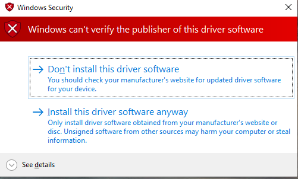

# HID Minidriver Eye Tracker Sample (DMF/VHF)

This *HID minidriver* sample demonstrates how to write a HID minidriver for eye trackers using the [Driver Module Framework (DMF)](https://github.com/microsoft/DMF) and the [Virtual HID Framework (VHF)](https://docs.microsoft.com/en-us/windows-hardware/drivers/hid/virtual-hid-framework--vhf-). This is a reference implementation to match the HID specification for eye trackers.

## Technical Notes

The driver utilizes [I/O control codes (IOCTLs)](https://docs.microsoft.com/en-us/windows-hardware/drivers/kernel/introduction-to-i-o-control-codes) to allow a user mode application to communicate with the driver. The included test app sends mouse coordinates to the driver, and includes commented code which would send a bouncing-line test pattern.

The use of the DMF brings a number of advantages. The driver itself has been built such that it can be used as is, extended, wrapped, etc. More documentation can be found at in the [announcement blog post](https://blogs.windows.com/windowsdeveloper/2018/08/15/introducing-driver-module-framework/) and [WinHEC 2018 presentation](https://www.microsoft.com/en-us/videoplayer/embed/RE2IIUT?pid=cx-video-1-oneplayer&postJsllMsg=true&autoplay=true&market=en-us).

For manufacturers this sample should provide the ultimate flexibility - use the driver as-is to pass in data from a user-mode process. As development progresses you can modify, wrap or extend the driver as needed.

## Compiling

To compile, you must install the [Windows Driver Kit](https://docs.microsoft.com/en-us/windows-hardware/drivers/download-the-wdk) and you must [install Spectre mitigation libraries](https://devblogs.microsoft.com/cppblog/spectre-mitigations-in-msvc/).

You will need to download the most current [EyeGazeIoctl driver implementation](https://github.com/joncamp/DMF/tree/personal/satertza/Gaze). You will need to build the *Dmf.sln* followed by the *DmfSamples/DmfSamples.sln*. Be sure to build for the appropriate platform, such as x64 or x86.

Finally, build *EyeGazeIoctlTestApp*.

## Driver Installation

In an administrator prompt, run "devcon install EyeGazeIoctl.inf root\EyeGazeIoctl" from the output directory of *Dmf\DmfSamples\EyeGazeIoctl*. If *devcon.exe* is not in your path, then it is located at *C:\Program Files (x86)\Windows Kits\10\Tools\x64\devcon.exe* or similar.

NOTE: Devcon WILL FAIL unless you have a kernel debugger running. Local kernel debugging is NOT sufficient. 

Accept the Windows Security prompt.

If successful, you will see an entry in *Device Manager* listed as *Samples->EyeGazeIoctl Device*

## Running

The sofware test application (EyeGazeIoctlTestApp.exe) needs no arguments to run. Also note that `EyeGazeIoctlTestApp.exe` needs to be run from an administrative prompt or from Visual Studio running in administrator mode.

## Testing

An easy way to see the driver working is to install the [Windows Community Toolkit Sample App](https://www.microsoft.com/en-us/p/windows-community-toolkit-sample-app/9nblggh4tlcq). Once 
installed, open the app and navitage to Gaze->Gaze Tracing. If prompted, be sure to authorize eye gaze for the application. If the everything is working properly
you should see a series of dots bouncing around the screen. The dots represent the gaze data being sent from [GhostHidFrameProc](drivers/ghost/GhostHid.c).

Also included in this repository is *GazeTracing*, a simple application which replicates the functionality of the GazeTracing page of the Windows Community Toolkit Sample App noted above. 

*textvhid* is a tool which dumps lots of information about the driver - raw report data, structure, results of HID queries, etc. 

## Related Topics

[Creating UMDF-based HID Minidrivers](http://msdn.microsoft.com/en-us/library/windows/hardware/hh439579)

[Human Input Devices Design Guide](http://msdn.microsoft.com/en-us/library/windows/hardware/ff539952)

[Human Input Devices Reference](http://msdn.microsoft.com/en-us/library/windows/hardware/ff539956)

[UMDF HID Minidriver IOCTLs](http://msdn.microsoft.com/en-us/library/windows/hardware/hh463977)