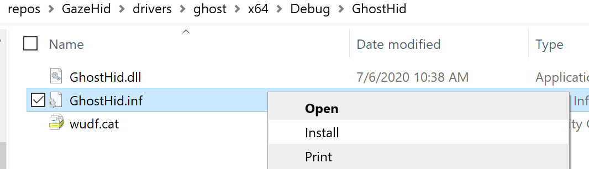
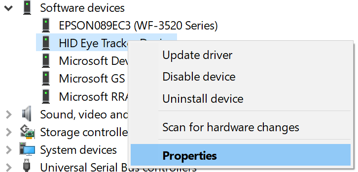
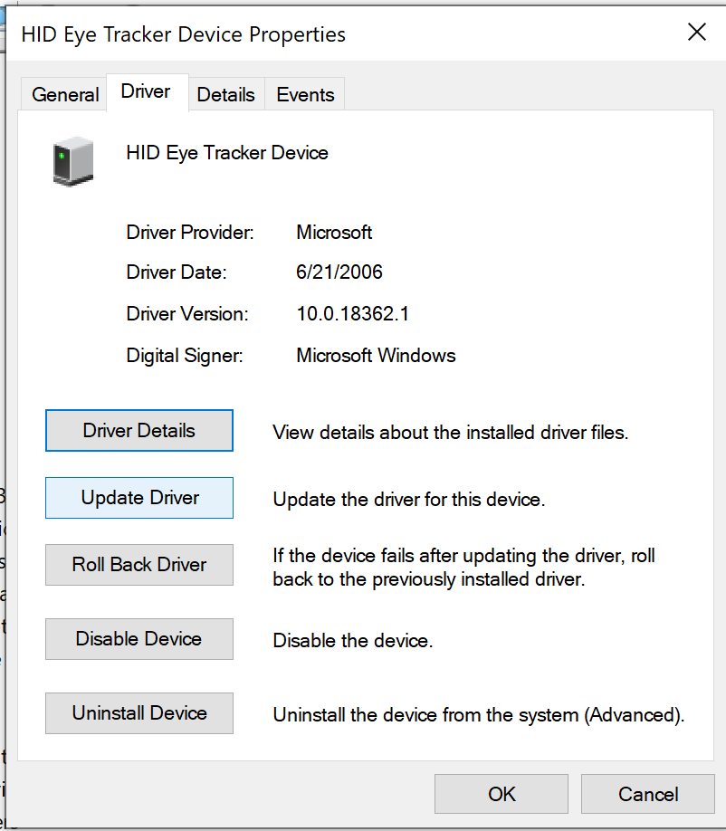
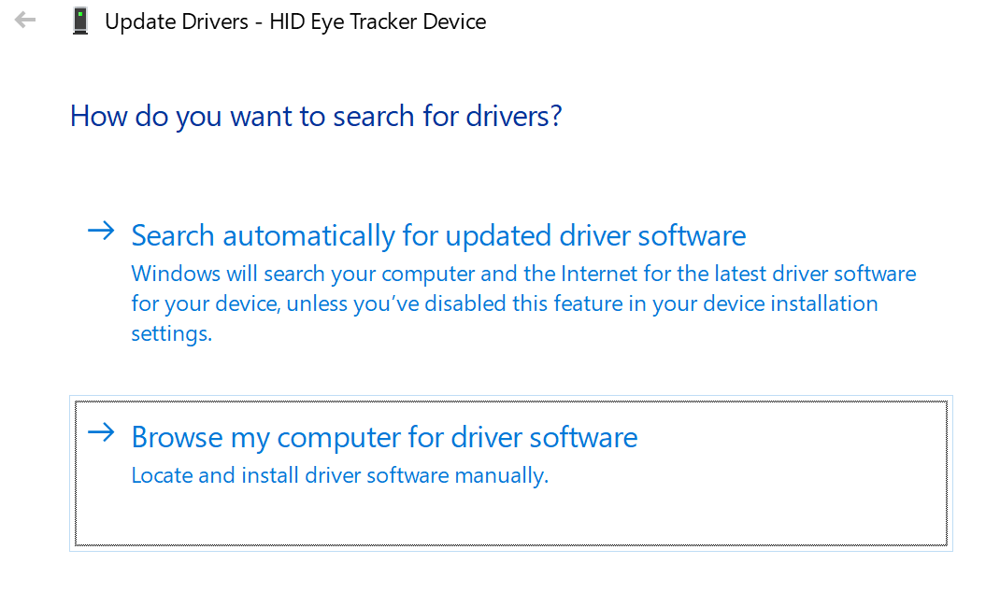
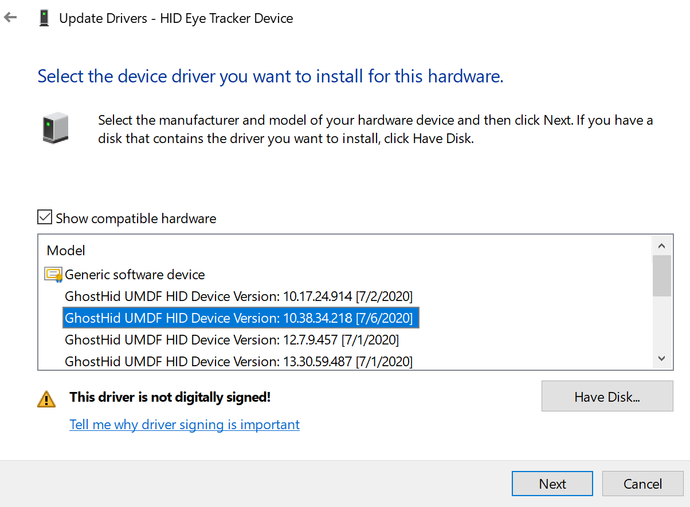
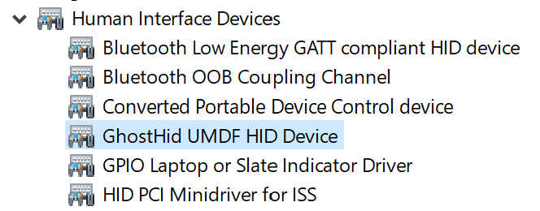

# HID Minidriver Eye Tracker Sample (UMDF V2)

The *HID minidriver* sample demonstrates how to write a HID minidriver using User-Mode Driver Framework (UMDF) for eye trackers. This is a reference implementation to match the HID specification for eye trackers.

## Compiling

To compile, you must install the [Windows Driver Kit](https://docs.microsoft.com/en-us/windows-hardware/drivers/download-the-wdk) and you must [install Spectre mitigation libraries](https://devblogs.microsoft.com/cppblog/spectre-mitigations-in-msvc/).

## Driver Installation

After compiling one of the drivers, you must navigate to to the binary output directory of the built drivers. Right click on the `.inf` file and select install, then follow the prompts.

## Running

The sofware device driver (swdevice.exe) needs arguments to run. You can pass in the aruments as two seperate values, such as `VID_1234 PID_5678`. As a single value you could similarly use `VID_1234&PID_5678`. Change the VID and PID to match your device. Also note that `swdevice.exe` needs to be run from an administrative prompt or from Visual Studio running in administrator mode.

Once running, you will see a prompt similar to this:

Once the swdevice is running, change the driver to the one you installed previously. First, open the device manager and open the `Software Devices` section. There you should see an entry for a `HID Eye Tracker Device`. Right click on it and select properties.

On the driver tab, select `Update Driver`.

In the subsequent dialog, first select `Browse my computer for driver software`.

On the following dialog, you should see the UMDF driver that was installed in the prior section. Select it and hit `Next`.

If everything worked correctly, you should now be able to find your device has moved to the `Human Interface Device` section and has been renamed to match your selected driver.

## Related Topics

[Creating UMDF-based HID Minidrivers](http://msdn.microsoft.com/en-us/library/windows/hardware/hh439579)

[Human Input Devices Design Guide](http://msdn.microsoft.com/en-us/library/windows/hardware/ff539952)

[Human Input Devices Reference](http://msdn.microsoft.com/en-us/library/windows/hardware/ff539956)

[UMDF HID Minidriver IOCTLs](http://msdn.microsoft.com/en-us/library/windows/hardware/hh463977)

## Contributing

This project welcomes contributions and suggestions. Most contributions require you to
agree to a Contributor License Agreement (CLA) declaring that you have the right to,
and actually do, grant us the rights to use your contribution. For details, visit
https://cla.microsoft.com.

When you submit a pull request, a CLA-bot will automatically determine whether you need
to provide a CLA and decorate the PR appropriately (e.g., label, comment). Simply follow the
instructions provided by the bot. You will only need to do this once across all repositories using our CLA.

This project has adopted the [Microsoft Open Source Code of Conduct](https://opensource.microsoft.com/codeofconduct/).
For more information see the [Code of Conduct FAQ](https://opensource.microsoft.com/codeofconduct/faq/)
or contact [opencode@microsoft.com](mailto:opencode@microsoft.com) with any additional questions or comments.
